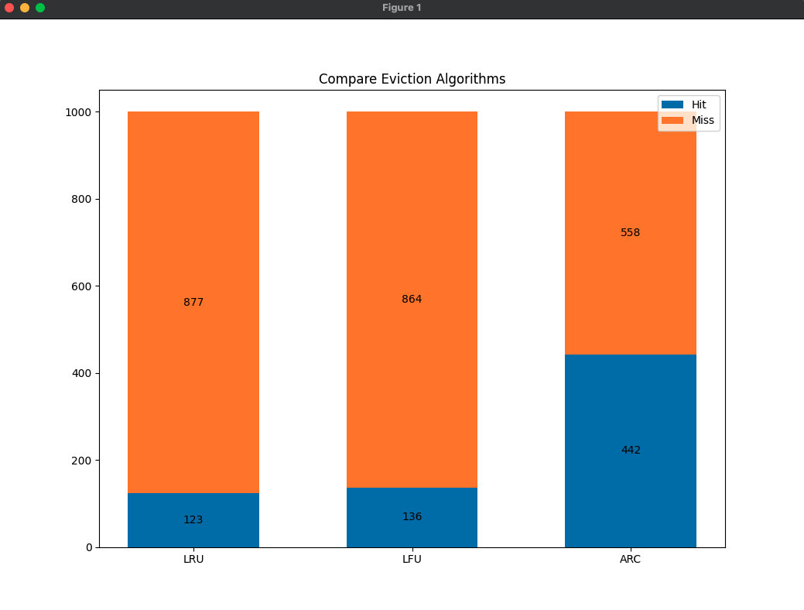
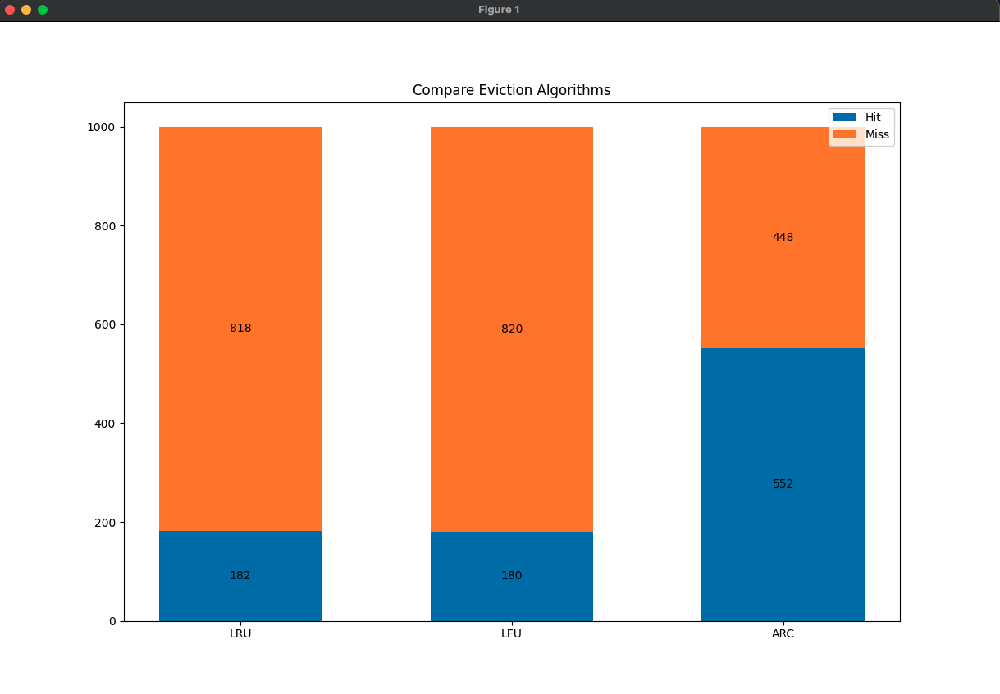
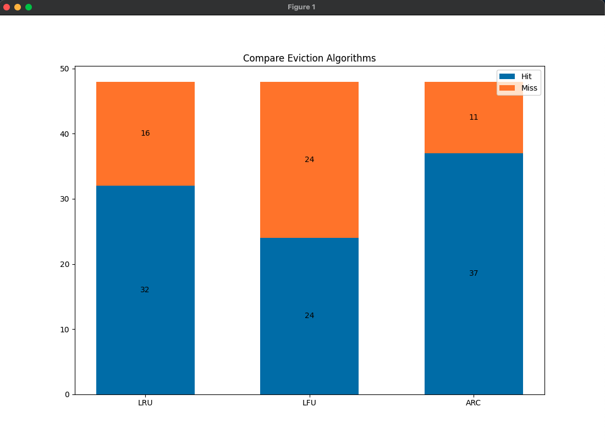

# Compare Cache Eviction Algorithms

This repository contains an implementation and comparison of various cache eviction algorithms. Caching is a common technique used in computer systems to improve performance by storing frequently accessed data in a fast-access memory, such as RAM or disk. When the cache becomes full, eviction algorithms determine which items to remove from the cache to make room for new ones.

The goal of this project is to explore different cache eviction algorithms and evaluate their performance under various scenarios. By comparing these algorithms, we can gain insights into their strengths, weaknesses, and suitability for different use cases.

Algorithms Implemented
Currently, the following cache eviction algorithms have been implemented in this repository:

- LRU (Least Recently Used)
- LFU (Least Frequently Used)
- ARC (Adaptive replacement cache)

// TODO: Algorithms explanation

Each algorithm has its own characteristics and trade-offs, and this project aims to provide a comprehensive comparison of their performance metrics, such as hit rate, miss rate, and cache efficiency.

## Getting Started

To get started with this project, follow these steps:

- Clone the repository:
```bash
git clone https://github.com/AlirezaEbrahimkhani/Compare-Cache-Eviction-Algorithms.git
```

- Install the necessary dependencies. `pip3 install -r requirements.txt`
- Explore the codebase and familiarize yourself with the implementation of each cache eviction algorithm.
- Run the provided benchmarking scripts to compare the algorithms' performance using predefined test cases or create your own custom scenarios.
- Analyze the results and draw conclusions about the effectiveness of each algorithm in different situations.

## Results
### Random numbers
<br>


### Weighted random numbers
<br>


### Real data
<br>



## Contributing

Contributions to this project are welcome! If you have ideas for improving existing algorithms, implementing new ones, or enhancing the benchmarking process, feel free to submit a pull request. Please ensure that your code adheres to the project's coding conventions and includes appropriate tests.

## License

This project is licensed under the MIT License. Feel free to use, modify, and distribute the code for both commercial and non-commercial purposes.

## Contact

If you have any questions, suggestions, or feedback, please feel free to contact the project maintainer:

- Alireza Ebrahimkhani - [Email](alirezaebrahimkhanidev@gmail.com)
- Nima Meghdadi - [Email](meghdadi.nima@gmail.com)
- Hamidreza Karami - [Email](hamidrezakarami16@gmail.com)

We hope this repository helps you gain a better understanding of cache eviction algorithms and their impact on system performance. Happy caching!
